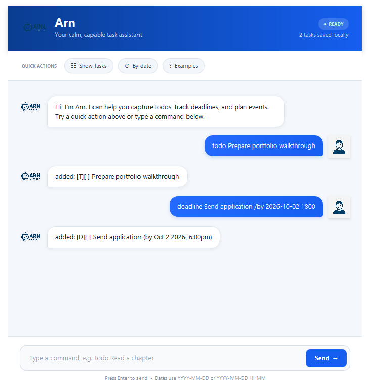

# Arn

[](https://github.com/Aryann-Sharma/ARN/actions/workflows/ci.yml)

Arn is a desktop task manager built with Java 17 and JavaFX. It supports todos, deadlines, and events through a command interface. Tasks are saved locally, so no account or internet connection is needed to use the app.



## Download and run

Download `Arn.jar` from the [releases page](https://github.com/Aryann-Sharma/ARN/releases), then run it from the directory where you want to keep your task data:

```bash
java -jar Arn.jar
```

Use **Java 17 for x64 Windows, Linux, or Intel macOS**. The runnable JAR includes JavaFX and its native libraries. Java must be installed separately. Native ARM builds are not included.

Type a command and press **Enter** or select **Send**. Quick actions show your tasks, sort dated tasks, or display examples. Quick actions preserve anything you are typing, and failed commands remain in the input field for correction.

A console interface is also available:

```bash
java -jar Arn.jar --cli
java -jar Arn.jar --help
java -jar Arn.jar --version
```

Console input and output use UTF-8. Use a terminal configured for UTF-8 when entering non-ASCII text. The console exits on `bye` or end of input.

See the [user guide](docs/README.md) for command examples and help with save files, or the [changelog](CHANGELOG.md) for release changes.

## Commands

| Action | Example |
| --- | --- |
| Add a todo | `todo Read a chapter` |
| Add a deadline | `deadline Submit report /by 2026-10-02 1800` |
| Add an event | `event Team lunch /from 2026-10-04 1200 /to 2026-10-04 1330` |
| Show tasks | `list` |
| Mark complete or incomplete | `mark 1`, `unmark 1` |
| Delete a task | `delete 1` |
| Search descriptions | `find report` |
| Show dated tasks chronologically | `sort` |
| Display a farewell; exit in console mode | `bye` |

Command names are lowercase and case-sensitive; searches ignore letter case. Dates use `YYYY-MM-DD` or `YYYY-MM-DD HHMM`, with 24-hour time. Invalid dates such as `2026-02-30` are rejected. An event's start and end must both include a time or both omit it, and the end cannot be earlier than the start.

`find` and `sort` use the current task numbers from `list`, so you can use those numbers with `mark`, `unmark`, and `delete`. These views do not change the list order. Deleting a task renumbers the tasks after it.

## Local storage

Tasks are stored in `data/arn.txt`, relative to the directory from which you launch Arn. The file is created on the first successful change. Viewing tasks or marking an already completed task does not rewrite it.

Each save writes a complete temporary file before replacing the existing file, using an atomic move where supported. If saving fails, Arn reports the error and restores the task list to its previous state. Older unversioned files are supported when they contain valid tasks encoded as UTF-8; see the [recovery instructions](docs/README.md#saving-and-recovering-data) for older files that need attention.

Arn stops at startup if it cannot read the save file or finds invalid data. Before saving, it checks whether the file has changed since it was loaded or last saved. If it has, restart Arn to load the newer tasks. The app does not automatically refresh an open task list. The `data/arn.txt.lock` file coordinates saves and normally remains on disk after exit.

Task descriptions are stored as plain text. The local `data/` directory is excluded from Git.

## Development

Clone the repository, open a terminal in its root directory, and install **x64 JDK 17**. Use the included Gradle wrapper to run or build the project.

On Windows:

```powershell
.\gradlew.bat run
.\gradlew.bat clean check shadowJar --warning-mode fail
```

On macOS or Linux:

```bash
./gradlew run
./gradlew clean check shadowJar --warning-mode fail
```

On Linux without a graphical session, run the checks under a virtual display:

```bash
xvfb-run --auto-servernum ./gradlew clean check shadowJar --warning-mode fail
```

The first build needs internet access to download dependencies. The application works offline after installation.

## Project structure

The main classes are under `src/main/java/arn/`:

| Area | Main classes | Responsibility |
| --- | --- | --- |
| Startup and command handling | `Launcher`, `Arn` | Start the chosen interface and save changes before reporting success |
| User interface | `MainWindow`, `DialogBox`, `Ui`, `Gui` | Collect input and display responses |
| Commands | `Parser` | Validate command syntax and update tasks |
| Task model | `TaskList`, `Task`, `Todo`, `Deadline`, `Event`, `TaskDate` | Manage tasks, dates, searches, and sorted views |
| Storage | `TaskFileHandler`, `StorageException` | Load and save tasks, report file errors, and check for conflicting saves |

FXML, CSS, and images are under `src/main/resources/`. Tests are under `src/test/java/arn/`.

## Tests and build output

`check` runs `test` and `jarSmokeTest`. These cover command parsing, dates, task storage, failed saves, and JavaFX interactions. The JAR tests start separate Java processes to check console commands, reopening saved tasks, startup errors, and desktop rendering.

| Output | Location |
| --- | --- |
| Unit and JavaFX test report | `build/reports/tests/test/index.html` |
| Packaged application test report | `build/reports/tests/jarSmokeTest/index.html` |
| JaCoCo coverage report | `build/reports/jacoco/test/html/index.html` |
| Packaged GUI screenshots | `build/reports/ui-smoke/` |
| Runnable fat JAR | `build/libs/Arn.jar` |

The coverage report measures code run by `test`; it does not include the separate processes started by `jarSmokeTest`.

GitHub Actions runs the checks on Windows, Linux, and Intel macOS for pull requests, pushes to `master`, and version tags. Compiler warnings fail the build. Reports are kept as workflow artifacts, and the Linux job also uploads `Arn.jar`. Dependabot is configured to check for dependency updates monthly.

For contribution and release steps, see [CONTRIBUTING.md](CONTRIBUTING.md).
